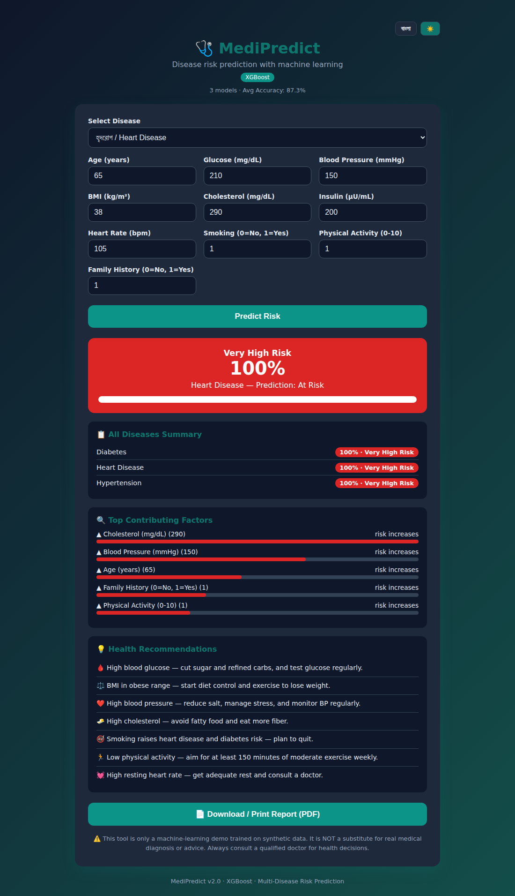
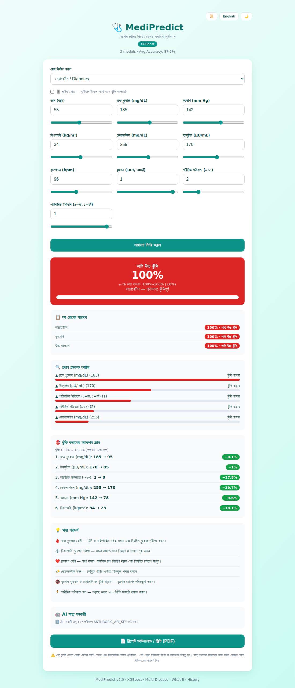
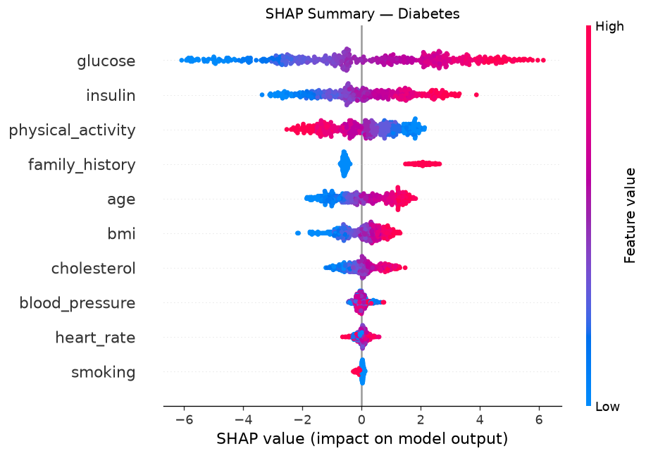
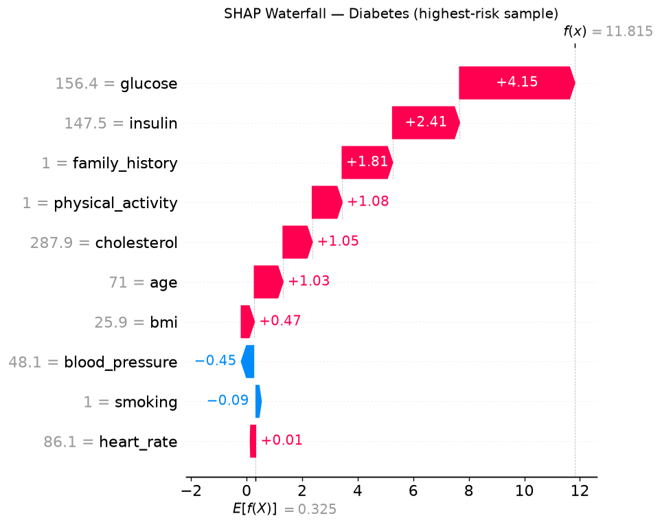
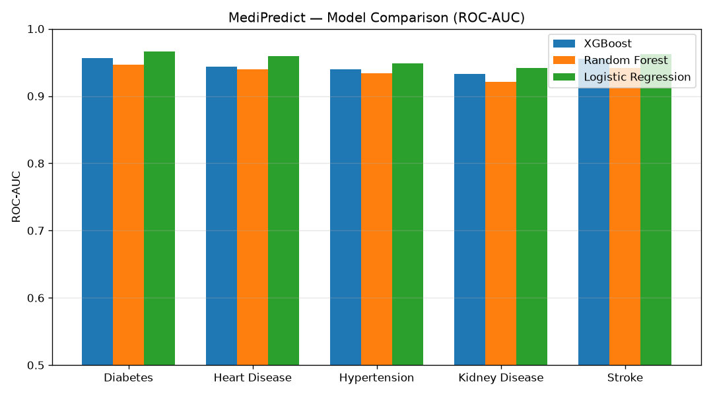
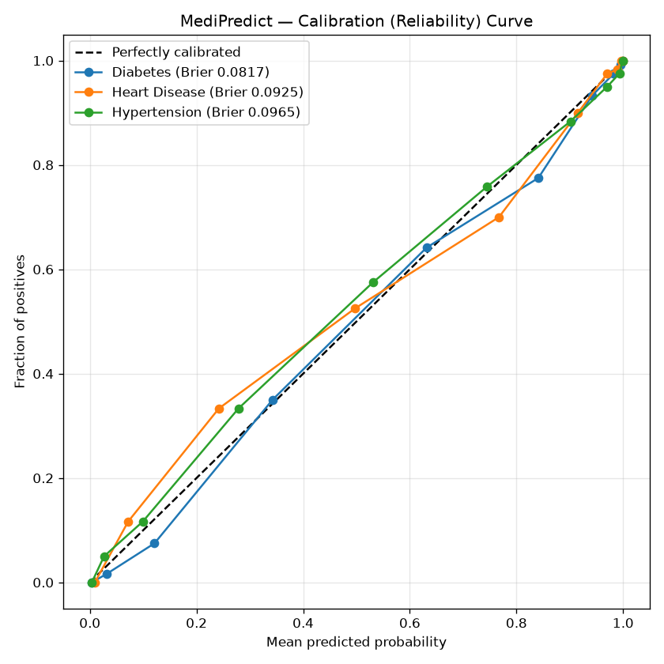

# 🩺 MediPredict

[](https://github.com/thecodebasedot/MediPredict/actions/workflows/ci.yml)


**XGBoost ভিত্তিক মাল্টি-ডিজিজ রোগের সম্ভাবনা পূর্বাভাস সিস্টেম** — একটি এন্ড-টু-এন্ড মেশিন লার্নিং প্রজেক্ট যা রোগীর স্বাস্থ্য সূচক (গ্লুকোজ, বিএমআই, রক্তচাপ ইত্যাদি) নিয়ে **ডায়াবেটিস, হৃদরোগ ও উচ্চ রক্তচাপের** সম্ভাবনা পূর্বাভাস দেয়।

| | |
|---|---|
| **প্রজেক্ট** | MediPredict |
| **সমস্যা সমাধান** | রোগের সম্ভাবনা পূর্বাভাস |
| **ML অ্যালগরিদম** | XGBoost (+ Random Forest, Logistic Regression তুলনা) |
| **রোগ** | ডায়াবেটিস · হৃদরোগ · উচ্চ রক্তচাপ |
| **ইন্টারফেস** | CLI + Flask ওয়েব অ্যাপ (বাংলা/English, ডার্ক মোড) |

> ⚠️ **দ্রষ্টব্য:** এই প্রজেক্টটি শিক্ষামূলক ডেমো। মডেলগুলো চিকিৎসাগতভাবে যুক্তিসঙ্গত নিয়মে তৈরি **সিনথেটিক ডেটায়** প্রশিক্ষিত। এটি প্রকৃত চিকিৎসা নির্ণয় বা পরামর্শের বিকল্প নয়।

---

## 📊 মডেল পারফরম্যান্স

| রোগ | Accuracy | ROC-AUC | Brier Score |
|---|---|---|---|
| ডায়াবেটিস (Diabetes) | 0.887 | 0.957 | 0.082 |
| হৃদরোগ (Heart Disease) | 0.870 | 0.944 | 0.093 |
| উচ্চ রক্তচাপ (Hypertension) | 0.863 | 0.940 | 0.097 |

> প্রতিটি রোগের জন্য আলাদা XGBoost মডেল · ৬,০০০ নমুনার সিনথেটিক ডেটাসেট · ৮০/২০ ট্রেন-টেস্ট স্প্লিট। (Brier score যত কম তত ভালো ক্যালিব্রেশন।)

---

## 🖼️ স্ক্রিনশট

| বাংলা (Light) | English (Dark) |
|---|---|
|  |  |

**Counterfactual অ্যাকশন প্ল্যান, কনফিডেন্স ইন্টারভ্যাল ও AI সহকারী:**



### SHAP ব্যাখ্যাযোগ্যতা (ডায়াবেটিস)
| Beeswarm Summary | Waterfall (একক রোগী) |
|---|---|
|  |  |

### মডেল তুলনা ও ক্যালিব্রেশন
| Model Comparison | Calibration Curve |
|---|---|
|  |  |

---

## ✨ ফিচার

### 🚀 সুপার-অ্যাডভান্সড
- 🎯 **Counterfactual অ্যাকশন প্ল্যান** — ঝুঁকি কমাতে সর্বনিম্ন কী কী বদলাতে হবে তার ক্রমানুসারে তালিকা (greedy অপ্টিমাইজেশন)
- 🔬 **পূর্ণ SHAP ভিজ্যুয়ালাইজেশন** — beeswarm summary ও waterfall প্লট
- 🤖 **AI স্বাস্থ্য সহকারী** — Claude API দিয়ে প্রশ্নোত্তর (বাংলা/English; `ANTHROPIC_API_KEY` দরকার)
- 📉 **প্রোবাবিলিটি ক্যালিব্রেশন + কনফিডেন্স ইন্টারভ্যাল** — bootstrap ensemble দিয়ে অনিশ্চয়তা পরিমাপ + reliability curve

### মূল ফিচার
- 🩺 **মাল্টি-ডিজিজ** — ডায়াবেটিস, হৃদরোগ ও উচ্চ রক্তচাপের আলাদা XGBoost মডেল
- 🎚️ **What-If সিমুলেটর** — স্লাইডার টানলে রিয়েল-টাইমে ঝুঁকি আপডেট (লাইভ মোড)
- 📜 **প্রেডিকশন হিস্টোরি** — SQLite-এ সংরক্ষণ ও পুনরুদ্ধার
- 🔧 **হাইপারপ্যারামিটার টিউনিং** — RandomizedSearchCV দিয়ে সেরা প্যারামিটার
- ⚙️ **GitHub Actions CI** — push/PR-এ স্বয়ংক্রিয় টেস্ট (Python 3.10–3.12)
- 💡 **দ্বিভাষিক স্বাস্থ্য পরামর্শ** ও 🔍 **ফিচার অবদান ব্যাখ্যা**
- 📈 **মডেল তুলনা** — XGBoost বনাম Random Forest বনাম Logistic Regression (চার্ট সহ)
- 📁 **ব্যাচ প্রেডিকশন** (CSV) · 🌓 **ডার্ক মোড + ভাষা টগল** · 📄 **PDF রিপোর্ট**
- 🌐 Flask ওয়েব অ্যাপ ও JSON API · 💻 CLI · 🐳 Docker · ✅ pytest (৯ টেস্ট)

---

## 📂 প্রজেক্ট স্ট্রাকচার

```
MediPredict/
├── src/
│   ├── config.py        # কনফিগ: পাথ, ফিচার, রোগ, হাইপারপ্যারামিটার
│   ├── data.py          # সিনথেটিক মাল্টি-ডিজিজ ডেটাসেট তৈরি/লোড
│   ├── train.py         # প্রতি রোগে XGBoost প্রশিক্ষণ ও মূল্যায়ন
│   ├── explain.py       # প্রেডিকশন ব্যাখ্যা (ফিচার অবদান)
│   ├── recommend.py     # দ্বিভাষিক স্বাস্থ্য পরামর্শ
│   ├── compare.py       # মডেল তুলনা + চার্ট
│   ├── tune.py          # হাইপারপ্যারামিটার টিউনিং (RandomizedSearchCV)
│   ├── history.py       # প্রেডিকশন হিস্টোরি (SQLite)
│   ├── counterfactual.py# ঝুঁকি কমানোর অ্যাকশন প্ল্যান
│   ├── calibrate.py     # ক্যালিব্রেশন + bootstrap অনিশ্চয়তা ensemble
│   ├── shap_explain.py  # SHAP beeswarm + waterfall প্লট
│   ├── assistant.py     # AI স্বাস্থ্য সহকারী (Claude API)
│   └── predict.py       # পূর্বাভাস (CLI + প্রোগ্রাম্যাটিক + ব্যাচ + মাল্টি + CI)
├── app/
│   ├── app.py           # Flask ওয়েব অ্যাপ (১১টি API এন্ডপয়েন্ট)
│   └── templates/
│       └── index.html   # বাংলা/English UI, ডার্ক মোড, What-If সিমুলেটর
├── tests/
│   └── test_pipeline.py # ৯টি pytest টেস্ট
├── .github/workflows/
│   └── ci.yml           # GitHub Actions CI (Python 3.10–3.12)
├── data/                # ডেটাসেট (অটো-জেনারেটেড) + sample_batch.csv
├── models/              # প্রশিক্ষিত মডেল (অটো-জেনারেটেড)
├── docs/                # স্ক্রিনশট ও চার্ট
├── Dockerfile
├── requirements.txt         # মূল নির্ভরতা
├── requirements-extra.txt   # ঐচ্ছিক: shap, anthropic
└── README.md
```

---

## 🚀 শুরু করা

### ১. ইনস্টলেশন

```bash
git clone https://github.com/thecodebasedot/medipredict.git
cd medipredict
pip install -r requirements.txt
pip install -r requirements-extra.txt   # ঐচ্ছিক: SHAP প্লট + AI সহকারী
```

### ২. মডেল প্রশিক্ষণ

```bash
python -m src.train            # ৩টি রোগের মডেল প্রশিক্ষণ
python -m src.calibrate        # (ঐচ্ছিক) ক্যালিব্রেশন + অনিশ্চয়তা ensemble
python -m src.compare          # (ঐচ্ছিক) মডেল তুলনা + চার্ট
python -m src.tune heart       # (ঐচ্ছিক) হাইপারপ্যারামিটার টিউনিং
python -m src.shap_explain     # (ঐচ্ছিক) SHAP প্লট তৈরি
```

> **AI সহকারী চালু করতে:** `export ANTHROPIC_API_KEY=sk-...` (ঐচ্ছিকভাবে `MEDIPREDICT_MODEL`)।

### ৩. পূর্বাভাস (CLI)

```bash
python -m src.predict
```
টার্মিনালে স্বাস্থ্য সূচক ইনপুট দিন; সব রোগের সারাংশ, প্রভাবক ফ্যাক্টর ও পরামর্শ দেখুন।

### ৪. ওয়েব অ্যাপ চালান

```bash
python -m app.app
```
ব্রাউজারে খুলুন: **http://127.0.0.1:5000**

---

## 🔌 API

| এন্ডপয়েন্ট | মেথড | কাজ |
|---|---|---|
| `/api/predict` | POST | একক রোগীর পূর্বাভাস + সব রোগের সারাংশ + ব্যাখ্যা + পরামর্শ |
| `/api/batch` | POST | CSV আপলোডে ব্যাচ পূর্বাভাস |
| `/api/diseases` | GET | সমর্থিত রোগের তালিকা |
| `/api/model-info` | GET | সব রোগের মডেল মেট্রিক ও ফিচার গুরুত্ব |
| `/api/comparison` | GET | মডেল তুলনার ফলাফল |
| `/api/history` | GET | সর্বশেষ পূর্বাভাসের হিস্টোরি (`?limit=N`) |
| `/api/history/clear` | POST | হিস্টোরি মুছে ফেলা |
| `/api/assistant/status` | GET | AI সহকারী ব্যবহারযোগ্য কিনা |
| `/api/assistant` | POST | AI সহকারীকে প্রশ্ন (`{question, context}`) |
| `/api/health` | GET | সার্ভার স্ট্যাটাস |

> `/api/predict` রেসপন্সে ঝুঁকিপূর্ণ হলে `action_plan` (counterfactual) এবং ensemble থাকলে `confidence_interval_percent` ও `uncertainty_percent` যুক্ত হয়।

`POST /api/predict`

```bash
curl -X POST http://127.0.0.1:5000/api/predict \
  -H "Content-Type: application/json" \
  -d '{"disease":"heart","age":65,"blood_pressure":160,"cholesterol":290,"smoking":1}'
```

রেসপন্স (সংক্ষিপ্ত):
```json
{
  "disease": "heart",
  "disease_name": "হৃদরোগ",
  "probability_percent": 100.0,
  "risk_level": "অতি উচ্চ ঝুঁকি",
  "risk_level_en": "Very High Risk",
  "explanation": [
    {"feature": "cholesterol", "label": "কোলেস্টেরল (mg/dL)",
     "label_en": "Cholesterol (mg/dL)", "value": 290.0,
     "contribution": 3.5, "direction": "বাড়ায়", "direction_en": "increases"}
  ],
  "recommendations": [{"bn": "🧈 কোলেস্টেরল উচ্চ — ...", "en": "🧈 High cholesterol — ..."}],
  "all_diseases": [{"disease_name": "ডায়াবেটিস", "probability_percent": 97.3, "risk_level": "..."}]
}
```
> `disease` ফিল্ড ঐচ্ছিক (ডিফল্ট `diabetes`); অনুপস্থিত ফিচারের জন্য ডিফল্ট মান ব্যবহার হয়।

`POST /api/batch` — CSV আপলোড (কলাম নাম `src/config.py` অনুযায়ী):

```bash
curl -X POST http://127.0.0.1:5000/api/batch \
  -F "file=@data/sample_batch.csv" -F "disease=diabetes"
```

---

## 🐳 Docker

```bash
docker build -t medipredict .
docker run -p 5000:5000 medipredict
```
ব্রাউজারে খুলুন: **http://127.0.0.1:5000**

---

## 🧪 ইনপুট ফিচার

| ফিচার | বিবরণ | রেঞ্জ |
|---|---|---|
| `age` | বয়স (বছর) | 1–120 |
| `glucose` | রক্তে গ্লুকোজ (mg/dL) | 50–300 |
| `blood_pressure` | রক্তচাপ (mm Hg) | 40–200 |
| `bmi` | বিএমআই (kg/m²) | 10–60 |
| `cholesterol` | কোলেস্টেরল (mg/dL) | 100–400 |
| `insulin` | ইনসুলিন (µU/mL) | 0–300 |
| `heart_rate` | হৃদস্পন্দন (bpm) | 40–180 |
| `smoking` | ধূমপান | 0 / 1 |
| `physical_activity` | শারীরিক সক্রিয়তা | 0–10 |
| `family_history` | পারিবারিক ইতিহাস | 0 / 1 |

---

## ✅ টেস্ট

```bash
pip install pytest
python -m pytest tests/ -v
```

---

## 🛠️ প্রকৃত ডেটায় ব্যবহার

বাস্তব ডেটাসেটে চালাতে `src/data.py` এর `load_dataset()` ফাংশনটি আপনার নিজের CSV লোডার দিয়ে প্রতিস্থাপন করুন (একই ফিচার ও রোগ-টার্গেট কলাম নাম রাখুন, দেখুন `src/config.py`)। তারপর আবার `python -m src.train` চালান।

নতুন রোগ যোগ করতে `src/config.py` এর `DISEASES` ডিকশনারিতে একটি এন্ট্রি (নাম + ফিচার ওজন) যোগ করুন — বাকি পাইপলাইন স্বয়ংক্রিয়ভাবে সেটি সমর্থন করবে।

---

## 📜 লাইসেন্স

[LICENSE](LICENSE) ফাইল দেখুন।
