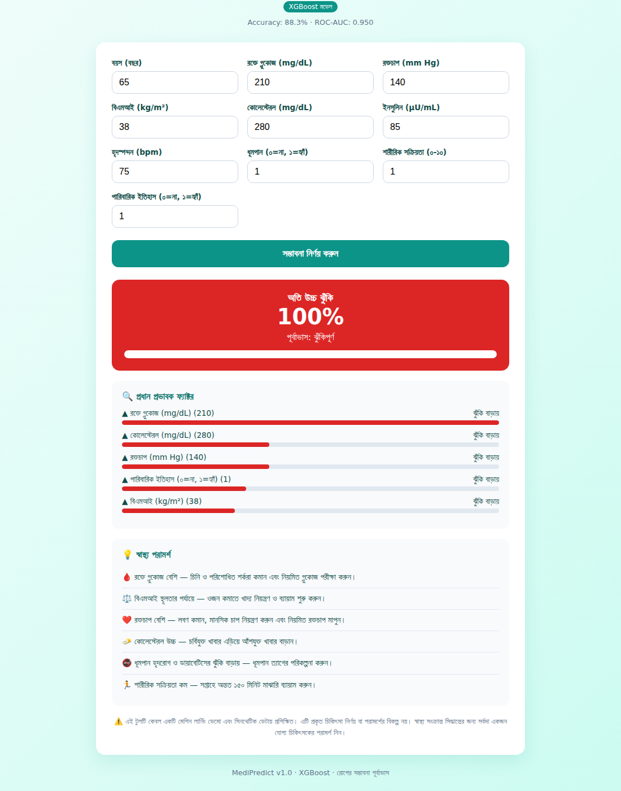

# 🩺 MediPredict

**XGBoost ভিত্তিক রোগের সম্ভাবনা পূর্বাভাস সিস্টেম** — একটি এন্ড-টু-এন্ড মেশিন লার্নিং প্রজেক্ট যা রোগীর স্বাস্থ্য সূচক (গ্লুকোজ, বিএমআই, রক্তচাপ ইত্যাদি) নিয়ে রোগের সম্ভাবনা পূর্বাভাস দেয়।

| | |
|---|---|
| **প্রজেক্ট** | MediPredict |
| **সমস্যা সমাধান** | রোগের সম্ভাবনা পূর্বাভাস |
| **ML অ্যালগরিদম** | XGBoost |
| **ইন্টারফেস** | CLI + Flask ওয়েব অ্যাপ (বাংলা UI) |

> ⚠️ **দ্রষ্টব্য:** এই প্রজেক্টটি শিক্ষামূলক ডেমো। মডেলটি চিকিৎসাগতভাবে যুক্তিসঙ্গত নিয়মে তৈরি **সিনথেটিক ডেটায়** প্রশিক্ষিত। এটি প্রকৃত চিকিৎসা নির্ণয় বা পরামর্শের বিকল্প নয়।

---

## 🖼️ স্ক্রিনশট



---

## ✨ ফিচার

- 📊 চিকিৎসাগত নিয়মভিত্তিক সিনথেটিক ডেটাসেট জেনারেটর
- 🤖 XGBoost ক্লাসিফায়ার (~৮৮% accuracy, ~০.৯৫ ROC-AUC)
- 📈 মডেল মূল্যায়ন: accuracy, ROC-AUC, confusion matrix, feature importance
- 🔍 **ব্যাখ্যাযোগ্যতা** — কোন ফ্যাক্টর প্রেডিকশনে কতটা অবদান রাখল (SHAP-স্টাইল)
- 💡 **ব্যক্তিগত স্বাস্থ্য পরামর্শ** — ইনপুট অনুযায়ী বাংলায় পরামর্শ
- 📁 **ব্যাচ প্রেডিকশন** — CSV আপলোডে একসাথে অনেক রোগীর পূর্বাভাস
- 🌐 বাংলা UI সহ Flask ওয়েব অ্যাপ ও JSON API
- 💻 ইন্টারঅ্যাক্টিভ CLI প্রেডিকশন
- 🐳 Docker সাপোর্ট
- ✅ pytest টেস্ট স্যুট

---

## 📂 প্রজেক্ট স্ট্রাকচার

```
MediPredict/
├── src/
│   ├── config.py        # কনফিগ: পাথ, ফিচার, হাইপারপ্যারামিটার
│   ├── data.py          # সিনথেটিক ডেটাসেট তৈরি/লোড
│   ├── train.py         # XGBoost প্রশিক্ষণ ও মূল্যায়ন
│   ├── explain.py       # প্রেডিকশন ব্যাখ্যা (ফিচার অবদান)
│   ├── recommend.py     # নিয়মভিত্তিক স্বাস্থ্য পরামর্শ
│   └── predict.py       # পূর্বাভাস (CLI + প্রোগ্রাম্যাটিক + ব্যাচ)
├── app/
│   ├── app.py           # Flask ওয়েব অ্যাপ
│   └── templates/
│       └── index.html   # বাংলা UI
├── tests/
│   └── test_pipeline.py # টেস্ট
├── data/                # ডেটাসেট (অটো-জেনারেটেড)
├── models/              # প্রশিক্ষিত মডেল (অটো-জেনারেটেড)
├── requirements.txt
└── README.md
```

---

## 🚀 শুরু করা

### ১. ইনস্টলেশন

```bash
git clone https://github.com/thecodebasedot/medipredict.git
cd medipredict
pip install -r requirements.txt
```

### ২. মডেল প্রশিক্ষণ

```bash
python -m src.train
```
এটি ডেটাসেট তৈরি করে, XGBoost মডেল প্রশিক্ষণ দেয় এবং `models/` এ সেভ করে।

### ৩. পূর্বাভাস (CLI)

```bash
python -m src.predict
```
টার্মিনালে স্বাস্থ্য সূচক ইনপুট দিন, রোগের সম্ভাবনা ও ঝুঁকি স্তর দেখুন।

### ৪. ওয়েব অ্যাপ চালান

```bash
python -m app.app
```
ব্রাউজারে খুলুন: **http://127.0.0.1:5000**

---

## 🔌 API

| এন্ডপয়েন্ট | মেথড | কাজ |
|---|---|---|
| `/api/predict` | POST | একক রোগীর পূর্বাভাস + ব্যাখ্যা + পরামর্শ |
| `/api/batch` | POST | CSV আপলোডে ব্যাচ পূর্বাভাস |
| `/api/model-info` | GET | মডেল মেট্রিক ও ফিচার গুরুত্ব |
| `/api/health` | GET | সার্ভার স্ট্যাটাস |

`POST /api/predict`

```bash
curl -X POST http://127.0.0.1:5000/api/predict \
  -H "Content-Type: application/json" \
  -d '{"age":60,"glucose":180,"bmi":34,"smoking":1,"family_history":1}'
```

রেসপন্স:
```json
{
  "probability": 0.9998,
  "probability_percent": 100.0,
  "prediction": 1,
  "risk_level": "অতি উচ্চ ঝুঁকি",
  "label": "ঝুঁকিপূর্ণ",
  "explanation": [
    {"feature": "glucose", "label": "রক্তে গ্লুকোজ (mg/dL)", "value": 180.0,
     "contribution": 3.82, "direction": "বাড়ায়"}
  ],
  "recommendations": ["🩸 রক্তে গ্লুকোজ বেশি — ...", "🚭 ধূমপান ..."]
}
```
> অনুপস্থিত ফিচারের জন্য ডিফল্ট মান ব্যবহার হয়।

`POST /api/batch` — CSV আপলোড (কলাম নাম `src/config.py` অনুযায়ী):

```bash
curl -X POST http://127.0.0.1:5000/api/batch -F "file=@data/sample_batch.csv"
```

---

## 🐳 Docker

```bash
docker build -t medipredict .
docker run -p 5000:5000 medipredict
```
ব্রাউজারে খুলুন: **http://127.0.0.1:5000**

---

## 🧪 ইনপুট ফিচার

| ফিচার | বিবরণ | রেঞ্জ |
|---|---|---|
| `age` | বয়স (বছর) | 1–120 |
| `glucose` | রক্তে গ্লুকোজ (mg/dL) | 50–300 |
| `blood_pressure` | রক্তচাপ (mm Hg) | 40–200 |
| `bmi` | বিএমআই (kg/m²) | 10–60 |
| `cholesterol` | কোলেস্টেরল (mg/dL) | 100–400 |
| `insulin` | ইনসুলিন (µU/mL) | 0–300 |
| `heart_rate` | হৃদস্পন্দন (bpm) | 40–180 |
| `smoking` | ধূমপান | 0 / 1 |
| `physical_activity` | শারীরিক সক্রিয়তা | 0–10 |
| `family_history` | পারিবারিক ইতিহাস | 0 / 1 |

---

## ✅ টেস্ট

```bash
pip install pytest
python -m pytest tests/ -v
```

---

## 🛠️ প্রকৃত ডেটায় ব্যবহার

বাস্তব ডেটাসেটে চালাতে `src/data.py` এর `load_dataset()` ফাংশনটি আপনার নিজের CSV লোডার দিয়ে প্রতিস্থাপন করুন (একই কলাম নাম রাখুন, দেখুন `src/config.py`)। তারপর আবার `python -m src.train` চালান।

---

## 📜 লাইসেন্স

[LICENSE](LICENSE) ফাইল দেখুন।
